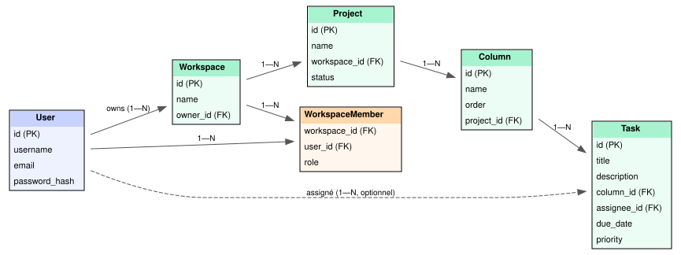

# Contrat d'API — TaskManager (Sujet C)

## Question 1 — Choix du sujet

Je retiens le **Sujet C — TaskManager**. Les règles métier les plus intéressantes à
modéliser sont l'appartenance à un workspace (qui conditionne toute visibilité en
cascade sur les projets, colonnes et tâches) et le déplacement d'une tâche entre
colonnes via un simple `PATCH`, qui oblige à valider que la colonne cible appartient
bien au même projet. La règle « un utilisateur n'est assignable que s'il est membre
du workspace » est aussi riche : elle demande de vérifier une relation indirecte
(membre du workspace, pas seulement du projet) avant d'accepter une écriture sur une
tâche. Enfin, l'archivage d'un projet pose la question de ce qui reste visible/modifiable
une fois archivé, sans supprimer les données.

## Question 2 — Tableau des ressources

| Ressource | URL collection | URL élément | Méthodes | Code succès |
|---|---|---|---|---|
| Workspace | `/api/v1/workspaces` | `/api/v1/workspaces/<id>` | GET, POST / GET, PATCH, DELETE | 200, 201 / 200, 200, 204 |
| Membre | `/api/v1/workspaces/<id>/members` | `/api/v1/workspaces/<id>/members/<user_id>` | GET, POST / DELETE | 200, 201 / 204 |
| Project | `/api/v1/workspaces/<workspace_id>/projects` | `/api/v1/projects/<id>` | GET, POST / GET, PATCH, DELETE | 200, 201 / 200, 200, 204 |
| Column | `/api/v1/projects/<project_id>/columns` | `/api/v1/columns/<id>` | GET, POST / PATCH, DELETE | 200, 201 / 200, 204 |
| Task | `/api/v1/columns/<column_id>/tasks` (+ `/api/v1/projects/<id>/tasks?status=&assignee_id=&priority=&due_date=` pour la vue filtrée) | `/api/v1/tasks/<id>` | GET, POST / GET, PATCH, DELETE | 200, 201 / 200, 200, 204 |

**Écarts au CRUD standard, justifiés :**
- **Pas de `PUT`** : toute modification passe par `PATCH` (y compris le déplacement de
  tâche via `column_id`), pour n'avoir qu'un seul verbe d'écriture partielle côté client.
- **Pas de route `/archive` dédiée** : l'archivage d'un projet est un simple `PATCH`
  sur le champ `status`, pour rester sur des ressources standard plutôt que multiplier
  les actions.
- **Sous-collection `/members`** plutôt qu'un champ `members` modifiable en `PATCH` sur
  `Workspace` : ajouter/retirer un membre est un événement métier propre (avec sa
  propre autorisation), pas un simple champ à écraser.
- **Tâches accessibles à la fois sous `/columns/<id>/tasks` et via `/projects/<id>/tasks`
  filtré** : la première sert à la création (une tâche naît dans une colonne), la
  seconde sert à la vue "board" avec filtres transverses.

## Question 3 — Codes d'erreur les plus fréquents

| Code | Situation métier concrète |
|---|---|
| **401** | Toute route protégée appelée sans jeton JWT valide (tout sauf `/auth/register`, `/auth/login`, `/health`). |
| **403** | Un utilisateur qui n'est pas membre d'un workspace tente de lire ou modifier un de ses projets/colonnes/tâches. |
| **409** | On tente d'assigner une tâche à un utilisateur qui n'est pas membre du workspace du projet, ou d'ajouter un membre déjà présent dans le workspace. |

## Question 4 — Schémas JSON

**Réponse d'erreur unique (toute l'API) :**
```json
{
  "error": {
    "code": "NOT_WORKSPACE_MEMBER",
    "message": "L'utilisateur assigné n'est pas membre de ce workspace.",
    "status": 409
  }
}
```

**Réponse de collection paginée :**
```json
{
  "data": [
    { "id": 1, "title": "Rédiger le cahier des charges", "column_id": 3 }
  ],
  "meta": {
    "page": 1,
    "per_page": 20,
    "total": 47,
    "total_pages": 3
  }
}
```

## Question 5 — Modèle de données

**Entités et cardinalités :**

| Relation | Cardinalité | Détail |
|---|---|---|
| `User` → `Workspace` | 1 — N | Un utilisateur peut posséder plusieurs workspaces (`Workspace.owner_id`) |
| `User` ↔ `Workspace` | N — N | Table d'association `WorkspaceMember` (`workspace_id`, `user_id`, `role`) |
| `Workspace` → `Project` | 1 — N | FK `Project.workspace_id` |
| `Project` → `Column` | 1 — N | FK `Column.project_id` |
| `Column` → `Task` | 1 — N | FK `Task.column_id` |
| `User` → `Task` (assigné) | 1 — N, optionnel | FK `Task.assignee_id`, nullable |

Le champ `role` de `WorkspaceMember` (`owner` / `member`) porte les deux rôles aux
permissions distinctes exigés par le cahier des charges : `owner` peut gérer les
membres et supprimer le workspace, `member` peut seulement lire/écrire sur les projets.

**Lazy vs eager :**

| Relation | Stratégie | Pourquoi |
|---|---|---|
| `Workspace.members`, `Workspace.projects` | lazy (`lazy="select"`) | Listes potentiellement longues, utiles seulement sur les endpoints qui les affichent explicitement (`GET /workspaces/<id>/members`, `.../projects`) — les charger partout ailleurs gaspillerait des requêtes |
| `Project.columns`, `Column.tasks` sur l'endpoint "board" (`GET /projects/<id>/board`) | eager (`joinedload` ciblé dans le service) | Évite le N+1 quand on affiche tout le tableau Kanban d'un coup ; ailleurs (ex. `GET /columns/<id>` seul), la relation reste lazy |
| `Task.assignee` | lazy | Chargé seulement si le schéma de sortie a besoin du nom de l'assigné — jointure ponctuelle plutôt que systématique |

## Diagramme entité-relation

